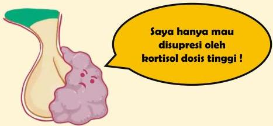

Atria.

# Penyakit Cushing

- Adenoma pada hipofisis yang menghasilkan ACTH berlebihan
- Tumor ini masih sedikit responsif terhadap feedback negatif sehingga tes deksametason high dose (8 mg) masih dapat menyupresi ACTH → sehingga kortisol serum turun

Sumber Gambar: Osmosis.org