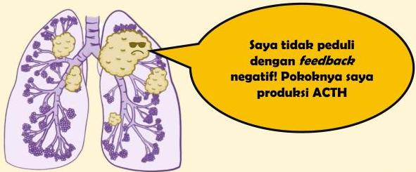

Atria.

# Tumor ACTH Ektopik

- Tumor bukan pada hipofisis yang dapat mensekresi ACTH secara mandiri (mis. small cell lung cancer)
- Tumor ini sama sekali tidak responsif terhadap feedback negatif → tes deksametason high dose (8 mg) tidak mensupresi ACTH

Sumber Gambar: Osmosis.org