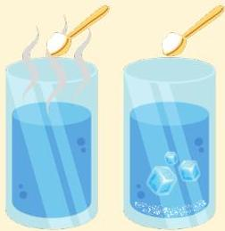

Atria.

# Artritis Gout

## Patofisiologi

- Asam urat biasanya larut dalam darah. Kelarutan tersebut dipengaruhi oleh 2 hal

2. Suhu → bila suhu terlalu rendah, asam urat akan mengkristal (pada lokasi yang jauh dari jantung, mis. jari jempol kaki)

Analogi: gula lebih mudah larut pada air panas dibanding air dingin