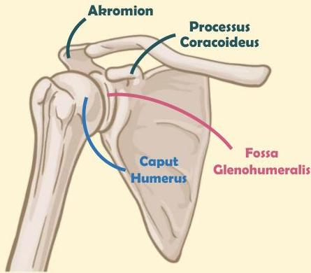

Atria.

# Anatomi Bahu Sederhana

Sendi bahu merupakan **Ball and socket joint**
- **Ball**: caput humerus
- **Socket**: fossa glenohumeralis

Fossa glenohumeralis **hanya menutupi 1/3 caput humerus** sehingga sendi ini rentan mengalami dislokasi

Sumber Gambar: Osmosis.org