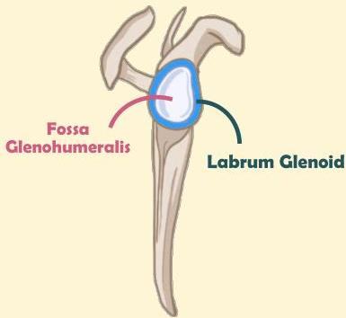

Atria.

# Anatomi Bahu Sederhana

Fossa glenohumeralis diliputi oleh labrum glenoid yang berfungsi untuk meningkatkan stabilitas sendi bahu

Labrum ini sering mengalami robekan saat terjadi dislokasi

Robeknya labrum sisi anterior akibat dislokasi bahu anterior disebut lesi Bankart

Sumber Gambar: Osmosis.org