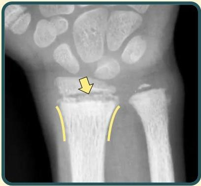

Atria.

# Metaphyseal Cupping, Flaring &amp; Fraying

Garis kuning → Metaphyseal cupping &amp; flaring (pelebaran metafisis ke arah lateral)

Panah kuning → Batas metafisis tampak ireguler dan tidak tegas