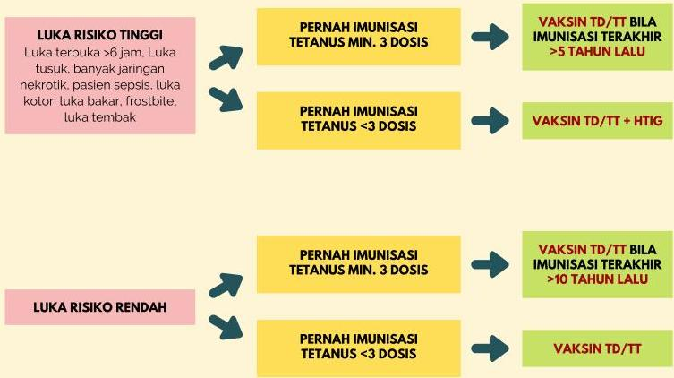

Atria.

# Algoritma Profilaksis Tetanus

## LUKA RISIKO TINGGI

Luka terbuka &gt;6 jam. Luka tusuk, banyak jaringan nekrotik, pasien sepsis, luka kotor, luka bakar, frostbite, luka tembak

## PERNAH IMUNISASI TETANUS MIN. 3 DOSIS

→ VAKSIN TD/TT BILA IMUNISASI TERAKHIR &gt;5 TAHUN LALU

## PERNAH IMUNISASI TETANUS &lt;3 DOSIS

→ VAKSIN TD/TT + HTIG

## LUKA RISIKO RENDAH

→ PERNAH IMUNISASI TETANUS MIN. 3 DOSIS

→ VAKSIN TD/TT BILA IMUNISASI TERAKHIR &gt;10 TAHUN LALU

## PERNAH IMUNISASI TETANUS &lt;3 DOSIS

→ VAKSIN TD/TT