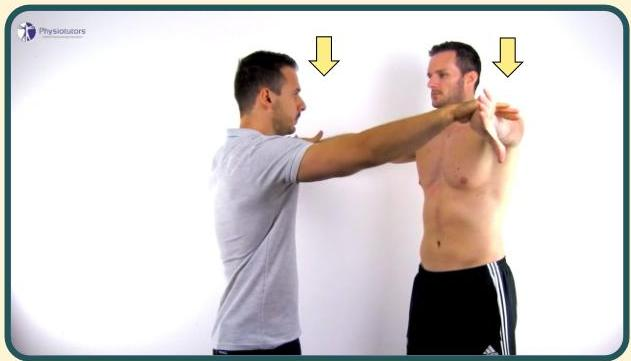

# Empty can test

Mengangkat tangan 90 derajat sejajar bahu, internal rotasi, pronasi, dengan arah jempol ke bawah. pemeriksa memberikan tahanan ke arah bawah

Positif bila nyeri

Atria.

Sumber video: Physiotutors