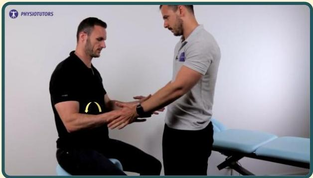

# Infraspinatus test

Fleksi lengan bawah 90 derajat dalam keadaan lengan bawah setengah pronasi. Pemeriksa melakukan tahanan sambal pasien melakukan rotasi eksterna.

Positif bila nyeri

Sumber video: Physiotutors