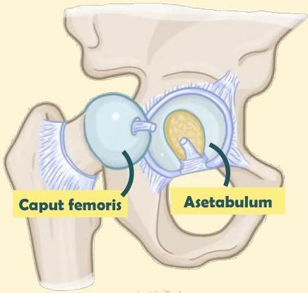

Atria.

# Anatomi Sendi Panggul

- Sendi panggul merupakan jenis sendi **ball and socket**
- **Ball: caput femoris**
- **Socket: fossa acetabulum**
- Fossa acetabulum hanya **menutupi** 40% dari caput femoris, sehingga dapat terjadi dislokasi

