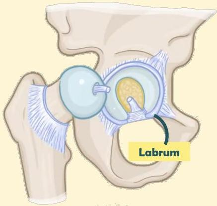

Atria.

# Anatomi sendi panggul

- Labrum acetabulum berfungsi untuk meningkatkan stabilitas sendi panggul
- Sisi anterior sendi dilewati N. femoralis; sementara sisi posterior dilewati N. sciatica

