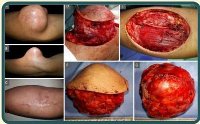

Atria.

# Fibrosarkoma

Pada lengan bawah kiri, tampak massa berbentuk bulat dengan batas tegas, berukuran 7-8 cm, konsistensi keras, yang mengarah pada kondisi fibrosarkoma

Sumber gambar: Scitemed