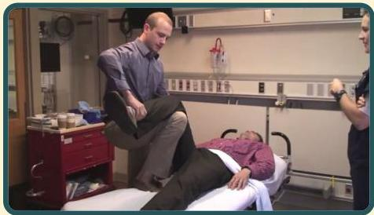

Atria.

# Manuver "Captain Morgan"

Pemeriksa menggunakan tungkainya sebagai tumpuan tungkai pasien; kemudian dilakukan traksi femur sambil mendorong kaki pasien dengan tangan ke bawah

Sumber video:HealthPartnersMedEd