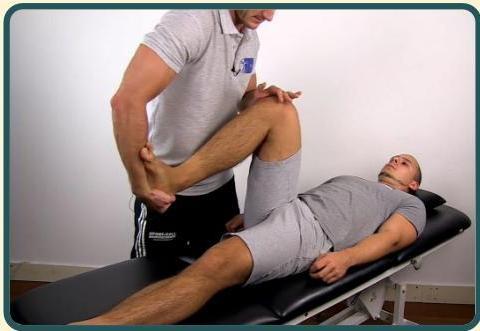

Atria.

# McMurray test
## Meniskus Lateralis

Rotasi interna tibia, lalu lakukan gerakan ekstensi berulang (dapat ditambah tenaga varus pada lutut → tidak dilakukan pada video ini)

Sumber video: Physiotutors