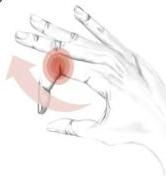
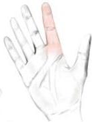
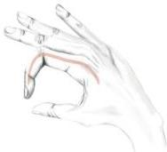
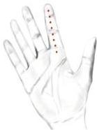

Atria.

1. Pain on passive extension (early sign)

2. "Sausage Finger" Fusiform swelling of a finger

3. Digit held in flexion

4. Pain along distribution of flexor sheath.

# Kanavel signs

Empat tanda cardinal yang ditemukan pada tenosynovitis supuratif