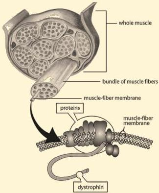

Atria.

# Duchenne Muscular Dystrophy

## Patofisiologi

- Protein dystrophin
- Berfungsi **mencegah kerusakan** serabut otot saat **kontraksi** dan **relaksasi**

- Gen dystrophin
- Kerusakan gen → gangguan produksi/fungsi protein dystrophin
- Nekrosis sel otot → digantikan jaringan ikat dan lemak → **pseudohipertrofi**

