# Arsitektur & Alur Eksekusi MedRAG (End-to-End Workflow)

Berikut adalah anatomi lengkap perjalanan data (Detik ke-0 hingga Output akhir) dari sistem Medical RAG mutakhir yang telah dibangun.

## Visualisasi Arsitektur (Mermaid Flowchart)

```mermaid
sequenceDiagram
    participant User as 👤 User (Frontend)
    participant API as 🌐 FastAPI (api.py)
    participant Ret as 🔍 Retriever (retriever.py)
    participant DB_FTS as 🗄️ SQLite (BM25 Lexical)
    participant DB_Vec as 📐 ChromaDB (Semantic Vector)
    participant GPT as 🧠 GPT-4.1 (copilot_client.py)

    User->>API: 1. Input: "Penanganan STEMI gawat darurat?"
    
    rect rgb(20, 50, 40)
        Note right of API: TAHAP 1: PRE-PROCESSING (NLP)
        API->>Ret: Teruskan Query
        Ret->>Ret: 2. Typo Correction & Extract Intent
        Ret->>Ret: 3. Ontology Expansion (STEMI -> ACS, Infark Miokard)
        Ret->>Ret: 4. Multi-Query Decomposition (Pecah jadi 4 Sub-Kueri paralel)
    end
    
    rect rgb(30, 20, 60)
        Note right of Ret: TAHAP 2: HYBRID RETRIEVAL (Dual-Core)
        par Lexical Search
            Ret->>DB_FTS: Query FTS5 + Fuzzy LIKE
            DB_FTS-->>Ret: BM25 Candidates
        and Semantic Search
            Ret->>DB_Vec: Query Embedding (all-MiniLM-L6)
            DB_Vec-->>Ret: Vector Candidates
        end
        Ret->>Ret: 5. Reciprocal Rank Fusion (RRF Gabungkan Skor)
        Ret->>Ret: 6. Dynamic Pruning (Jaccard Similarity < 0.6)
        Ret->>Ret: 7. Disease Gating (Buang hasil di luar penyakit target)
        Ret-->>API: Evidence Chunks Terseleksi
    end
    
    rect rgb(60, 40, 20)
        Note right of API: TAHAP 3: INTENT-DRIVEN IMAGE RETRIEVAL
        API->>DB_FTS: 8. Cari Gambar +/- 1 Halaman dari Evidence
        DB_FTS-->>API: Gambar Rontgen & Diagram
        API->>API: 9. Image Intent Scoring (Beri +200% Skor jika berjudul 'Alur'/'Bagan')
    end
    
    rect rgb(50, 10, 30)
        Note left of GPT: TAHAP 4: AGENTIC SYNTHESIS & REASONING
        API->>GPT: 10. Kirim Prompt + Evidence Chunks + Image (Base64)
        GPT-->>GPT: 11. Self-Reflection: Buat "verification_log" (Cek Halusinasi)
        GPT-->>GPT: 12. Vision OCR: Terjemahkan Bagan Visual -> Poin IF-THEN
        GPT-->>GPT: 13. Clinical Reasoning Engine: Rumuskan DDx & Red Flags
        GPT-->>API: JSON Output (Sections, Markdown, Citations)
    end
    
    API-->>User: 14. Render UI Elegan (Teks + Sitasi + Bagan Tatalaksana Mutlak)
```

---

## Penjelasan Detil Tiap Tahapan (*Step-by-Step*)

### TAHAP 1: Pembacaan Otak Niat (Intent & Ontology Analysis)
1. **User Mengetik**: Anda memberikan pertanyaan, misal *"Jelaskan penanganan akut STEMI"*.
2. **Koreksi & Ekspansi Ontologi**: Mesin otomatis membenarkan jika ada *typo* medis. Lalu, singkatan `"STEMI"` langsung terekspansi menjadi `"Infark Miokard"`, `"ACS"`, `"SKA"`, dan `"Serangan Jantung"`.
3. **Multi-Query Decomposition (Gurita Pencari)**: Pertanyaan tadi tidak dicari secara bulat. Sistem mendelegasikan 4 kueri pencari ke *database* secara latar belakang (Contoh: mencari 'Patofisiologi', 'Gejala Klinis', 'Obat', dan 'Komplikasi').

### TAHAP 2: Penarikan Data Mematikan (Hybrid Retrieval)
4. **Pencarian Paralel**:
   - **Lexical (BM25 FTS5)** membaca kecocokan huruf, menyapu semua paragraf yang menyebutkan "Infark Miokard" atau "STEMI".
   - **Vector (ChromaDB)** secara cerdas memahami makna abstrak (Semantik), menangkap paragraf terkait "pasien nyeri dada khas menjalar" meskipun tidak ada kata STEMI.
5. **RRF & Pruning**: Ribuan balok kalimat disortir ulang lewat kalkulasi skor matematika fusi (Reciprocal Rank Fusion/RRF). Setelah itu, teks-teks repetitif langsung dihanguskan menggunakan algoritma *Jaccard Similarity* untuk memastikan LLM tidak dijejali sampah kembar.
6. **Mekanisme Jendela Geser (*Sliding Window*)**: Fragmen teks yang didapat selalu mengingat kalimat terakhir dari paragraf sebelumnya (overlap), memastikan tabel atau resep dosis LLM utuh tidak terpotong (Low-compute context fix).

### TAHAP 3: Visual Targeting (Pemindai Mata Elang)
7. **Pencarian Gambar Intent-Based**: API memeriksa jenis pertanyaan. Karena Anda bertanya `"penanganan"`, pemindai akan menyapu radius `± 1 Halaman` dari teks *evidence*, mencari gambar. Saat *database* memuntahkan foto X-Ray dan Diagram Tata Laksana secara bersamaan, algoritma langsung memberi *buff* +200% poin kepada gambar berjudul **"Alur"** atau **"Tatalaksana"**, mengubur gambar X-Ray jauh ke bawah. Bagan SOP klinis pun ditarik menggeser gambar lain.

### TAHAP 4: Eksekusi Agen Medis (Reasoning & Copilot)
8. **Pengiriman (*Payload Prompt*)**: GPT-4.1 menerima seluruh balok teks, gambar klinis berwujud kode Base64, dan Instruksi Sistem (Prompt) yang sangat ketat.
9. **Karantina Halusinasi Internal (*Agentic Reflection*)**: Sebelum mulai menulis rangkuman medis, AI dipaksa mengekseskusi log rahasia perikso diri (`"verification_log"`). Ia berorasi sendiri: *"Obat Aspirin disebut di Evidence 2? Benar. Dosis 160-320 mg terpampang di halaman 3? Benar."* Hal ini membunuh halusinasi di titik 0.
10. **Vision Flowchart Extraction**: AI menatap gambar diagram algoritma STEMI, lalu memecah peta visual tersebut menjadi teks instruksional (Misal: *Jika O2 < 90%, THEN Berikan Kanul O2*).
11. **Clinical Reasoning (Diagnosis Alternatif & Red Flags)**: AI diatur secara mutlak untuk melampirkan Diagnosis Banding (DDx) dan ancaman kegawatdaruratan pada penutup *markdown*-nya, sembari menancapkan panah referensi akurat ala dokter *`(Mediko, p. 55)`* di mana ia menemukan kutipan tersebut.
12. **Pengembalian (JSON Render)**: Data matang kembali ke antarmuka aplikasi dengan rupa desain UI nan elegan untuk dikaji oleh penggunanya.
